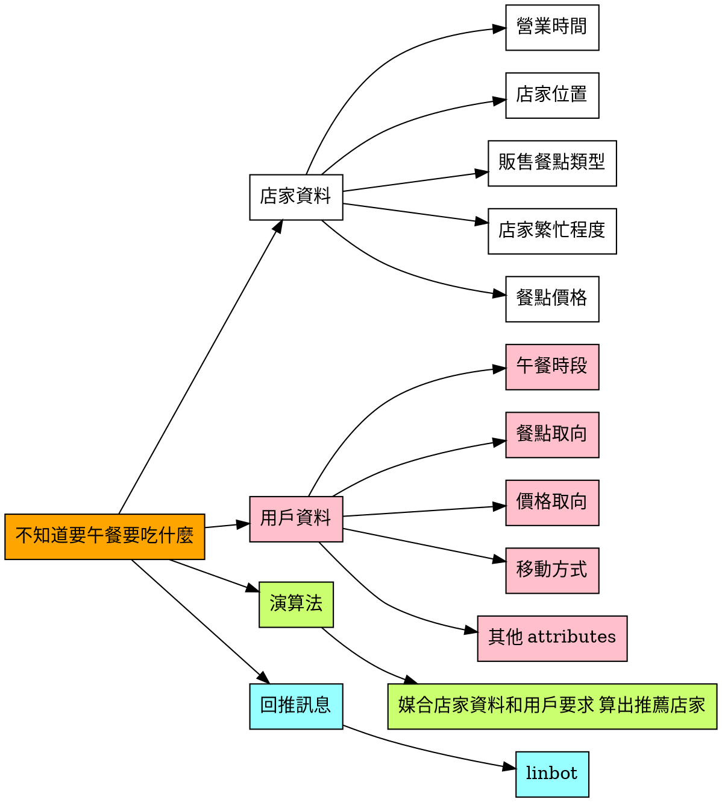

# CTPS-FINAL

## Linbot-sever.py  
#### 主程式
## Algorithm.py     
#### 推薦演算法，媒合餐廳端資料與顧客端資料
## config.ini       
#### 儲存 channel-access-token、channel-secret 資料

## Preface

生活在成大將近4年，我們每天的午餐時間看著形形色色的店家，看似玲瑯滿目卻都吃膩了，中午覓食已經從期待變成壓力，每天問著「待會吃什麼?」，然後花費大量時間和心力，還是不知道要午餐吃什麼。因此我們希望運用Computational Thinking and Problem Solving 的思維，幫助大家解決這個困擾已久的問題。

## Team members

| Name         | School ID | Email                     |
| ------------ | --------- | ------------------------- |
| 許孝華 | E54066133       | s0917275664@gmail.com |
| 林鑫伯 | E54062058       | a0906256956@gmail.com |
| 莊雲澔 | D44076020       | lasib890612@gmail.com |
| 楊文宇 | H44081052       | poteryang10@gmail.com |
| 周明坤 | AN4096750       |AN4096750@gs.ncku.edu.tw|

## Problem Definition

#### My target problem - 解決成大師生不知道午餐吃什麼的困擾?

## Problem Decomposition

- **人**：成大師生
- **事**:午餐煩惱
- **時**：週一到週五 11點 ~ 14點
- **地**：成大周遭 1.5km 以內距離
- **constrain** : 交通限制(交通工具)、店家營業時間限制、用戶人數(餐廳是否能容納)、預計等待及用餐時間

## Pattern Recognition

1. 大家通常到正餐時間才會想要吃甚麼
2. 大家移動的距離有限，如果下午1點還有課，就會在學校附近用餐
3. 同類型食物太頻繁吃會吃膩
4. 學生會考慮cp值(有價格區間考量)
5. 如果店家以人潮眾多就傾向換一間店家
6. 會因為天氣而影響選擇(例如很熱，就會找有冷氣的餐廳)
7. 朋友或認識的同學會一起用餐

## Abstraction

#### (把Problem Decomposition的細項問題化)

- **店家資料**
    - 1. 如何取得店家資料?
    - 2. 如何確保店家資料即時性?
- **用戶資料**
    - 1. 如何取得用戶資料?
    - 2. 如何做到使用者優化?
- **演算法**
    - 1. 如何根據實際狀況設計演算法
    - 2. 怎麼測試演算法結果是否符合用戶需求
- **訊息回推**
    - 1. 用什麼管道回送推薦清單
    - 2. 介面如何優化
    - 3. 怎麼得知用戶實際使用情況

## Algorithm
- **店家資料**
    - 如何取得店家資料?
        - 利用 google maps 爬蟲
        - 實地探索(地點限制在成大周圍，所以有一定可行性)
    - 如何確保店家資料即時性?
        - 設計用戶回報機制
        - 定期網路爬蟲
- **用戶資料**
    - 如何取得用戶資料?
        - 利用 linbot 與使用者溝通，取得使用者需求
    - 如何做到使用者優化?
        - 利用 richmenus 串接 linbot，藉由圖文選單輸入
- **演算法**
    - 如何根據實際狀況設計演算法
        - 找外在生活條件(例如 : 天氣很熱，那冷氣的需求權重就提高一點)
    - 怎麼測試演算法結果是否符合用戶需求
        - 請朋友實際使用，並根據意見做出修改
- **訊息回推**
    - 用什麼管道回送推薦清單
        - Linebot
    - 介面如何優化
        - 建置模板按鈕，讓畫面看起來乾淨一點
    - 怎麼得知用戶實際使用情況
        - 設計用戶評分機制
        - 根據用戶評分或意見，進行修正

## Solution Proposal

## final report ppt & demo
- [期末報告 PPT](https://docs.google.com/presentation/d/14qQ4UPfRpipqk7Z_lndYVSX4U7moSff1B9T4pLNx16A/edit#slide=id.gdc04e28e13_11_66)

- demo 影片


## Project Work Partition and Task Owners
- 問題發想和統籌規劃 - **許孝華**
- 店家資料收集 
    - 搜尋店家 - **莊雲澔** **楊文宇**
    - 測量抵達時間 - **莊雲澔**
    - 網路爬蟲 - **楊文宇** **莊雲澔**
- 使用者優化設計 
    - 電腦版介面設計 - **許孝華**
    - line developer 圖文選單 - **許孝華**
    - richmenus 圖文選單撰寫 -**林鑫伯**
    - richmenus 圖片製作 -**周明坤**
- 餐廳推薦演算法設計 - **林鑫伯**
- Linebot 設計 - **許孝華 林鑫伯**
- 成品測試及debug - **林鑫伯 許孝華**

- 期中 presentation - **許孝華 莊雲澔**
- 期末 presentation - **所有人**
- final template 撰寫 - **許孝華**
- source code 整理 - **林鑫伯**
- demo video  錄製 - **許孝華**
## References
- [Final Project Template](https://playlab.computing.ncku.edu.tw:3001/QDl1-LDMS66IoNG44h4E7A)
